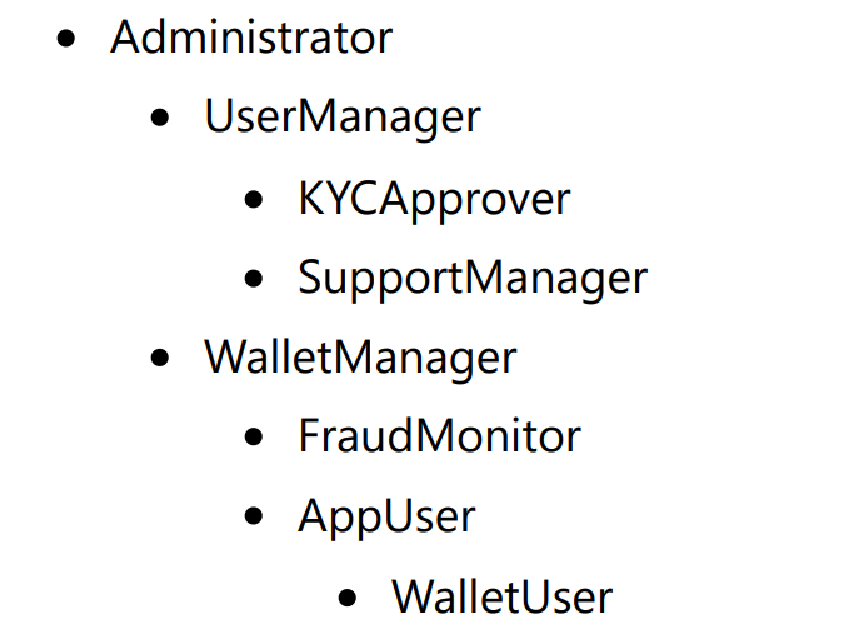

JWT Token based

`Authentication and Authorization`

secure REST API

- Hierarchical Role Supported

_Administrator_ can perform all operation _UserManager_ can also perform what .. can perform

    KYCApprover
    SupportManager

#*_Parent role_* has all privilege of it's *_children role_*#

*Run Config* Set Environment Variable

- JWT_SIGN_KEY | Base64 | Sync Key